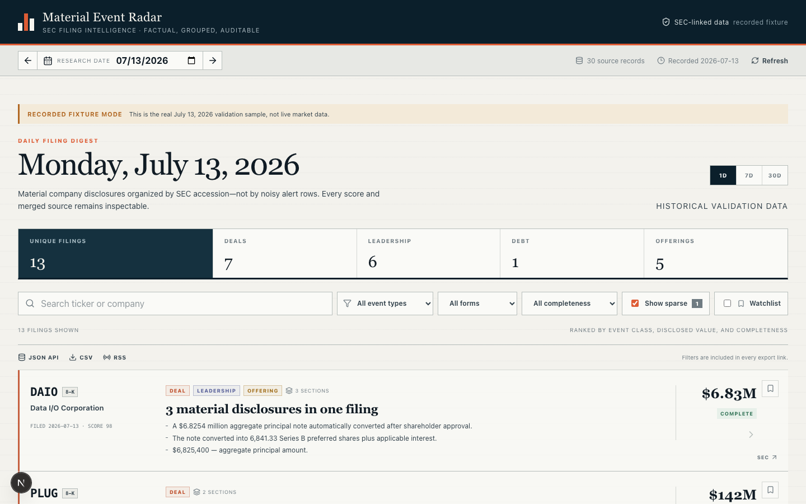
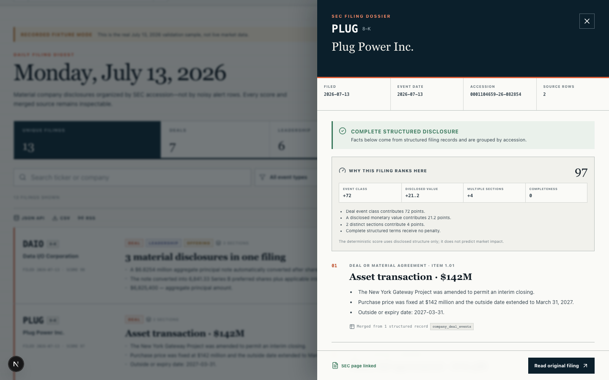

<div align="center">
  <h1>Material Event Radar — Open-source SEC Filing Monitor</h1>

  <p>
    <a href="https://github.com/huluwa2026/material-event-radar/actions/workflows/ci.yml"></a>
    <a href="https://github.com/huluwa2026/material-event-radar/actions/workflows/codeql.yml"></a>
    <a href="LICENSE"></a>
    <a href="https://material-event-radar.vercel.app"></a>
  </p>

  <p><strong>See what companies disclosed—not why prices moved.</strong></p>
  <p>An open-source monitor for material company events disclosed in SEC filings, including Forms 8-K and 6-K. Material Event Radar groups structured events by filing, ranks them transparently, and always links back to the original SEC disclosure.</p>
  <p><em>An independent open-source project, not an official Drillr product.</em></p>

  <p>
    <a href="https://material-event-radar.vercel.app">Open the live radar</a> ·
    <a href="https://material-event-radar.vercel.app/api/v1/events">JSON API</a> ·
    <a href="https://material-event-radar.vercel.app/feed.xml">RSS feed</a> ·
    <a href="docs/architecture.md">Architecture</a> ·
    <a href="https://drillr.ai/l/material-radar-gh">Build with Drillr</a>
  </p>
</div>



## Why it is different

- **Filing first:** collapses duplicate source rows by SEC accession while preserving distinct matters as sections.
- **Auditable:** exposes source tables, merged row counts, completeness, score components, and the original SEC filing.
- **Honest about gaps:** sparse extraction is hidden by default and missing terms are never inferred.
- **Built for scanning:** daily and 7/30-day timelines, shareable filters, local watchlists, and responsive filing dossiers.
- **Open data surfaces:** filtered JSON, CSV, and RSS use the same factual aggregation model as the interface.

## What it monitors

Material Event Radar turns structured SEC filing data into a daily, auditable view of company disclosures. It currently covers acquisitions and other deals, executive departures and appointments, debt issuance, and securities offerings. Results preserve the SEC accession number and original disclosure link so every summary can be checked against its source.

### Filing audit view



## Try it locally without credentials

Requirements: Node.js 20.9 or newer.

```bash
npm install
npm run dev:fixture
```

Open [http://localhost:3000/?date=2026-07-13](http://localhost:3000/?date=2026-07-13). Fixture mode uses the real recorded July 13, 2026 validation sample and labels it clearly as historical data. It never pretends to be live.

## Run with live [Drillr data](https://drillr.ai/l/material-radar-gh)

```bash
cp .env.example .env.local
npm run dev
```

Set the server-only values in `.env.local`:

```dotenv
DRILLR_API_KEY=drl_replace_me
SEC_USER_AGENT=material-event-radar/0.1 your-email@example.com
```

Create a [Drillr API key](https://drillr.ai/l/material-radar-gh). `DRILLR_API_KEY` is read only by the Node.js server; it is never returned by an API route, logged, embedded in HTML, or placed in a `NEXT_PUBLIC_*` variable.

The public hosted instance serves rolling 1/7/30-day windows ending on the latest complete weekday. A self-hosted instance can opt into arbitrary historical dates by setting `RADAR_ALLOW_HISTORICAL_DATES=true`; those requests use that deployment's own server-side key.

## SEC filing monitor capabilities

- Queries `company_deal_events`, `executive_change`, `debt_issuance`, and `securities_offering` in four parallel requests.
- Excludes synthetic `news_*` accessions and joins company identity inside the queries.
- Merges complementary deals, debt, offerings, departures, and appointments without discarding distinct events.
- Supports 1, 7, and 30 calendar-day views with one bounded range query per source table.
- Persists ticker watchlists only in browser local storage; no account is required and watchlists never leave the browser.
- Keeps search, category, form, completeness, window, watchlist mode, and open filing in shareable URLs.
- Provides deterministic importance-score explanations and per-section source-table provenance.
- Displays source mode, refresh time, row counts, extraction completeness, and SEC verification state.

## API, CSV, and RSS

The versioned read-only API supports identical filters across JSON, CSV, and RSS:

```bash
curl 'https://material-event-radar.vercel.app/api/v1/events?window=7&category=deal'
curl -OJL 'https://material-event-radar.vercel.app/api/v1/events?format=csv'
```

Subscribe to a filtered feed:

```text
https://material-event-radar.vercel.app/feed.xml?window=7&tickers=NVDA,AAPL
```

See [Public API and feeds](docs/api.md) for parameters, response shape, rate limits, and caching behavior.

## Data flow

```text
Browser
  └─ Next.js server API
       ├─ 4 parallel Drillr SQL requests
       ├─ accession aggregation and deterministic ranking
       ├─ SEC link/form verification for daily views
       └─ shared persistent date/window cache
```

The hosted routes apply conservative request budgets and reuse a persistent date/window cache. The detailed boundaries and range-query design are documented in [Architecture](docs/architecture.md).

## Privacy

The hosted site uses Vercel Web Analytics for anonymous, aggregate page views and referrers. It does not use analytics cookies or custom interaction events. Query strings and URL fragments are removed before an event is sent, so searches, tickers, watchlists, filters, and selected filings are not included in analytics. Outbound Drillr links use readable branded short links; Drillr records the project source after a click without exposing UTM parameters in the browser address bar.

## Validation

The fixed 2026-07-13 regression fixture represents 30 structured rows collapsed into 13 filings. It covers:

- Public Storage notes offering
- Plug Power's two property transactions in one filing
- Agenus and Silo Pharma private placements
- Data I/O's nine records and three logical sections
- N-able's departure/appointment transition
- Braskem's Form 6-K boundary
- the historical sparse-extraction case for TOP Financial

Run the full local quality suite:

```bash
npm test
npm run typecheck
npm run lint
npm run build
npm run test:e2e
```

Playwright automatically starts fixture mode, so browser tests do not need production credentials. GitHub Actions runs the same unit, type, lint, build, browser, and CodeQL checks.

## Configuration

| Variable | Required | Default | Purpose |
|---|---:|---|---|
| `DRILLR_API_KEY` | Live mode | — | Server-side Drillr authentication |
| `RADAR_DATA_MODE` | No | `live` | Set `fixture` for the recorded validation sample |
| `DRILLR_API_BASE_URL` | No | `https://gateway.drillr.ai` | Drillr REST base URL |
| `SEC_USER_AGENT` | Recommended | App identifier | Identifies SEC requests responsibly |
| `EVENT_CACHE_TTL_SECONDS` | No | `3600` | Shared aggregated date/window cache |
| `SEC_METADATA_CACHE_TTL_SECONDS` | No | `604800` | SEC form/link metadata cache |
| `RADAR_ALLOW_HISTORICAL_DATES` | No | `false` | Permit arbitrary dates on a self-hosted instance |
| `PUBLIC_MAX_FILINGS` | No | `100` | Maximum JSON/CSV filings returned per request |
| `PUBLIC_MAX_RSS_ITEMS` | No | `50` | Maximum RSS items returned per request |
| `PUBLIC_RATE_LIMIT_PER_MINUTE` | No | `20` | Best-effort per-address minute budget |
| `PUBLIC_RATE_LIMIT_PER_DAY` | No | `200` | Best-effort per-address daily budget |

## Contributing and security

Read [CONTRIBUTING.md](CONTRIBUTING.md), browse the [roadmap](ROADMAP.md), or start with a [`good first issue`](https://github.com/huluwa2026/material-event-radar/labels/good%20first%20issue). Questions and open-ended ideas belong in [Discussions](https://github.com/huluwa2026/material-event-radar/discussions).

Report vulnerabilities privately through the instructions in [SECURITY.md](SECURITY.md). Community participation follows the [Code of Conduct](CODE_OF_CONDUCT.md). Release history is in [CHANGELOG.md](CHANGELOG.md).

## Scope

This project reports what a company disclosed. It does not mix news with filings, infer missing financial terms, attribute stock moves, manage portfolios, or make buy/sell recommendations.

MIT licensed. This independent project accesses structured event data through Drillr; SEC.gov remains the original disclosure source. It is not affiliated with or endorsed by Drillr.
